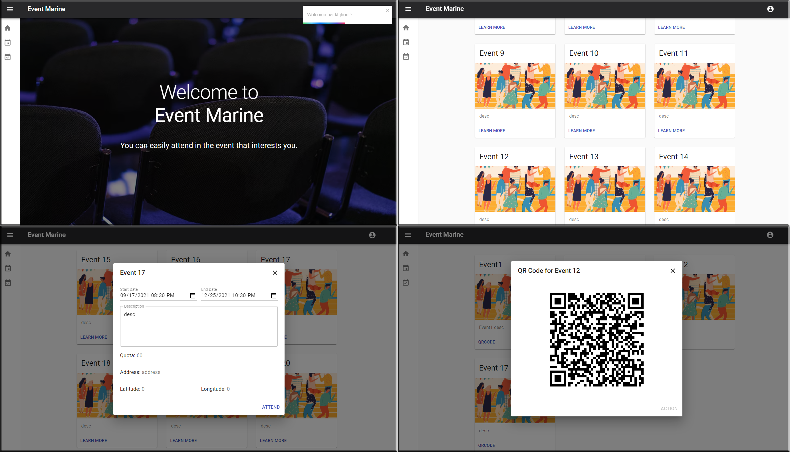

# Event Marine

Event Marine is a web application for organizing and attending events.

## Screenshots

Guest

External User

Internal User

Event Information

### Running

1. Change the application properties under src/main/resources

2. Create JAR file in target directory by executing command below

`mvn package`

3. Run project with docker

`docker-compose up --build`

3.1. Run project from JAR file.

3.1.1 Set Up a PostgreSQL Database.

3.1.2 Execute blow command under target directory

`java -jar -Dspring.profiles.active=dev eventmarine-1.0.jar`

3.2. Run project for development.

3.2.1. Set Up a PostgreSQL Database.

3.2.1 Start backend: src/main/java/yte/intern/Application.java

3.2.1 Start frontend: execute below command under frontend directory

`yarn start`

## License

This project is licensed under the MIT License - see the [LICENSE.md](LICENSE.md) file for details
